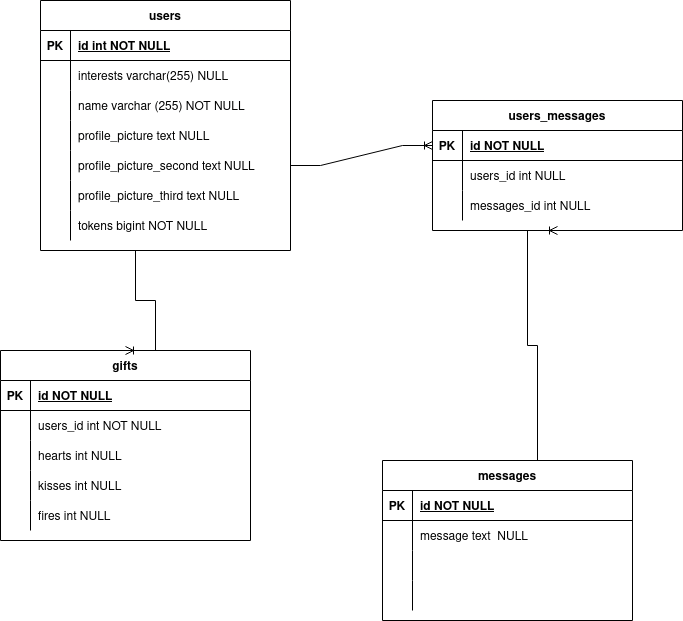

# Requeriments to build the application

> Nodejs
>
> php7+

## Steps to setup the application

- Create .env.local and setup the database
- Create .env.test and setup the database for tests
- Install dependencies
> Composer install
>
> npm install
>
- initialize database
> php bin/console doctrine:database:create
>
> php bin/console doctrine:schema:create
>
- Exec migrations
> php bin/console doctrine:migrations:migrate
>
- initialize database for tests
> php bin/console --env=test doctrine:database:create
>
- Create the tables and columns in test database.
> php bin/console --env=test doctrine:schema:create
>
- load test fixtures
> php bin/console --env=test doctrine:fixtures:load

## Database structure

